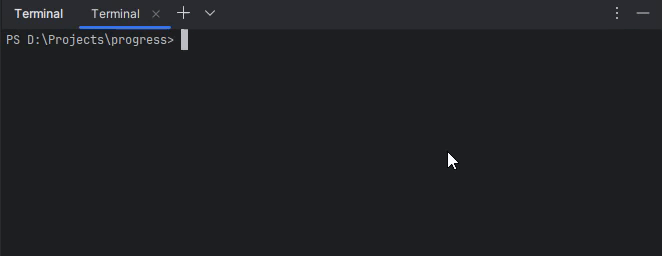

<div align="center">

# Progress

[](https://standardjs.com)


Progress is a simple command line tool to track your progress on various tasks. 

</div>

<div align="center">



</div>

## Installation

```bash
npm install @olton/progress
```

## Usage

```js
import { Progress } from "@olton/progress";

const options = {}
const progress = new Progress(options);

for (let i = 0; i < 100; i++) {
    setTimeout(() => {
        progress.process();
    }, i * 100);
}
```

### process()

The `process(increment, processMessage)` method updates the progress bar. You can call it multiple times to update the progress.

```js
progress.process();
```

Default values for `increment` is `1` and for `processMessage` is `''`.

### reset()
The `reset()` method resets the progress bar to the initial state. You can call it multiple times to reset the progress.

```js
progress.reset();
```

## Options

```js
const ProgressOptions = {
    total: 1,
    completed: 0,
    width: 30,
    mode: 'default', // default, dots, bar
    showCompleteMessage: false,
    completeMessageColor: "green",
    completeMessage: '',
    completeMessagePosition: 'defailt', // default or inline, newline
    barColor: "green",
    processMessage: '',
    processMessageColor: "gray",
    dotsType: 'dots', // dots, clock
}
```

### completeMessage
The message shown when the progress is completed. You can use the following replacers:
- `{{total}}`: Total number of operations.
- `{{elapsed}}`: Elapsed time in seconds.

For example: `Completed {{total}} operations in {{elapsed}}s`.

### processMessage
The message shown when the progress is updated. You can use the following replacers:
- `{{total}}`: Total number of operations.
- `{{completed}}`: Number of completed operations.
- `{{elapsed}}`: Elapsed time in seconds.
- `{{percent}}`: Percentage of completion.
- `{{rate}}`: Rate of completion.

For example: `Completed {{completed}} of {{total}} in {{elapsed}}s ({{percent}}%)`.

> [!NOTE]
> You can use the `processMessage` for `bar`, and `dots` modes. For `default` mode, the `processMessage` is not used.

## Progress Modes

- `default`: Shows a progress bar with the percentage of completion.
- `dots`: Shows a series of dots to indicate progress.
- `bar`: Shows a progress bar with the percentage of completion.


## Colors
For `bar`, `processMessage`, `startMessage`, and `completeMessage` you can use different colors.

You can use named colors - `black`, `red`, `green`, `yellow`, `blue`,
`magenta`, `cyan`, `white`, `blackBright`, `gray`, `redBright`, `greenBright`,
`yellowBright`, `blueBright`, `magentaBright`, `cyanBright`, `whiteBright`.

Also, you can use hex colors. For example: `#ff0000`.

### Default Mode

Options for default mode:

```js
const options = {
    mode: 'default',
    total: 100,
    completed: 0,
    width: 30,
    barColor: "green",
    showStartMessage: true,
    showCompleteMessage: true,
}
```

### Dots Mode

Options for dots mode:

```js
const options = {
    mode: 'dots',
    total: 100,
    completed: 0,
    dotsType: 'dots', // dots, clock, moon, earth
    showStartMessage: true,
    showCompleteMessage: true,
    barColor: "green",
}
```

#### Dots Types
- `dots`: Shows a series of dots to indicate progress.
```js
["⠋", "⠙", "⠹", "⠸", "⠼", "⠴", "⠦", "⠧", "⠇", "⠏"]
```
- `clock`: Shows a clock to indicate progress.
```js
["🕛", "🕐", "🕑", "🕒", "🕓", "🕔", "🕕", "🕖", "🕗", "🕘", "🕙", "🕚"]
```
- `moon`: Shows a moon to indicate progress.
```js
["🌑", "🌒", "🌓", "🌔", "🌕", "🌖", "🌗", "🌘"]
```
- `earth`: Shows an earth to indicate progress.
```js
["🌍", "🌍", "🌍", "🌎", "🌎", "🌎", "🌏", "🌏", "🌏"]
```

### Bar Mode
Options for bar mode:

```js
const options = {
    mode: 'bar',
    total: 100,
    completed: 0,
    width: 30,
    barColor: "green",
    processMessageColor: "gray",
    showStartMessage: true,
    showCompleteMessage: true,
}
```

---
## License

This project is licensed under the MIT License. See the [LICENSE](LICENSE) file for details.

---
## Code Standards

[](https://github.com/standard/standard)

